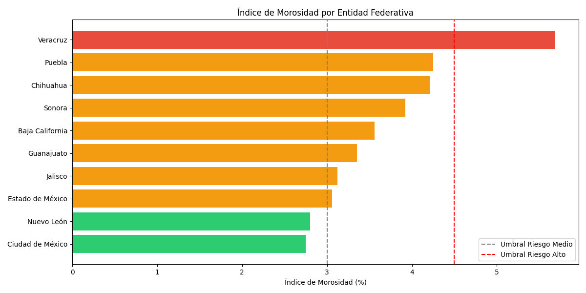

# credit-risk-dashboard
Automated pipeline for credit risk analysis with Python and Power BI
# Credit Risk Geographic Analysis Dashboard

Automated pipeline for geographic credit risk analysis using Python and Power BI.

## Overview
This project identifies high-risk geographic zones by processing large-scale 
financial data, applying clustering models, and visualizing results in an 
interactive Power BI dashboard.

## Tech Stack
- **Python** — data extraction, cleaning and automation
- **SQL** — data querying and transformation
- **Power BI** — interactive geographic dashboard
- **Git/GitHub** — version control

## Project Structure
data/raw/ → original datasets
data/processed/ → cleaned and transformed data
notebooks/ → exploratory analysis
scripts/ → automated pipeline
reports/ → Power BI dashboard

## Status
In progress

## Preview

## Dashboard Preview

